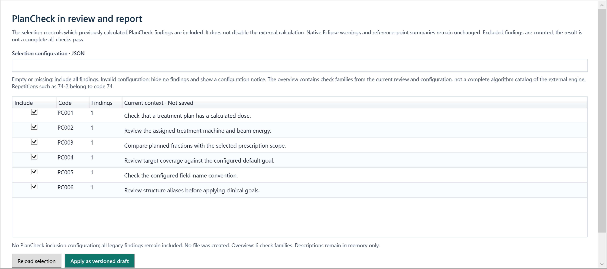

# ClearPlan

**Configurable, read-only radiotherapy plan review — shared across the workspace and report.**

ClearPlan brings clinical goals, plan checks, DVHs, target and delivery metrics,
CT overlays, and optional BEV/geometry views into one review workflow. Its purpose
is to make a clinic's own checks and documentation easier to maintain, inspect,
and reuse—not to approve a treatment plan automatically.

The current source is **3.2.0-dev.20260916.1**, a development snapshot requiring
local commissioning. [The evaluated code snapshot](https://github.com/Kiragroh/ClearPlan-OpenSource/tree/98aed7bc2fb3ecbced7cc2a520f691da36c53bfa)
is distinct from the older [v3.2.0 release](https://github.com/Kiragroh/ClearPlan-OpenSource/releases/tag/v3.2.0).
Software tests are not evidence of clinical safety or effectiveness.

## Start here

| I want to… | Read |
|---|---|
| Try ClearPlan without a TPS or patient | [Patient-free quick start](docs/developer-handoff.md#patient-free-build-and-test) |
| Set paths, constraints, aliases, and defaults | [Configuration guide](docs/configuration-guide.md) |
| Introduce ClearPlan at another clinic | [Clinic onboarding](docs/CLINIC_ONBOARDING.md) |
| Understand calculations and limitations | [Methods and review behavior](docs/index.md#methods-and-review-behavior) |
| Extend checks or connect another scripting API | [Architecture](docs/architecture.md) and [developer handoff](docs/developer-handoff.md) |
| Reproduce native ESAPI or Citrix tests | [Runner and native-test workflow](docs/native-testing.md) |

## What it adds

- **Editable local policy:** RefDB JSON or Excel constraints, explicit aliases,
  target rules, field-name conventions, check inclusion, and versioned history.
  Public starter rules are not a clinic's complete commissioned PlanCheck.
- **One review state:** shared structure visibility, wide DVHs, three-plane CT
  overlays, compact findings, active-plan PDF/HTML reports, and separate plan
  comparison. German/English selection changes presentation, not identifiers or measurements.
- **Additional measurements:** target-specific PAM with physical single- or
  dual-layer effective apertures, Paddick CI and its reciprocal, GI/HI, total MU,
  aperture summaries, and explicitly estimated—not measured—dose-rate traces.
- **A reusable boundary:** an ESAPI-independent snapshot and shared WPF/reporting
  components. The Eclipse host is read-only. The RayStation adapter is illustrative
  and unvalidated, not feature-equivalent clinical support.

See the [actual Settings gallery](docs/settings-gallery.md) for editable defaults,
constraint history, aliases, and check selection. These patient-free captures use
the real WPF views with public configuration fixtures and labeled demo history.



## Quick check on Windows

Requires Windows x64, MSBuild, and .NET Framework 4.8 developer tools.
No licensed TPS assemblies or patient data are needed:

```powershell
.\tools\test-portable-review.ps1
.\artifacts\simulator\Debug\ClearPlan.Simulator.exe --scenario mixed-review
```

The simulator uses explicitly synthetic records. A licensed Eclipse build needs
additional dependencies and local checks; follow the
[build guide](docs/developer-handoff.md). Use your approved execution policy.

Portable tests and the simulator need no Runner. Native integration tests need
an authorized ESAPI host; our Citrix workflow uses the separately maintained
[ESAPI Runner Hub](https://github.com/Kiragroh/ESAPI-Runner-Hub) to reopen explicit
planning contexts and record launch outcomes. Application assertions and rendered
reports are verified separately. ClearPlan can also run in Eclipse or another
suitable authorized host; see [why this distinction matters](docs/native-testing.md).

## Safety, privacy, and research scope

Inspection does not modify TPS plans, structures, beams, or dose. Optional ARIA
report upload is a separate, explicitly configured patient-record write, disabled
by default. Missing evidence is not a successful check. Geometry illustrations
are not collision clearance; a rate estimate is not a delivery log.

Public contributions must not contain patient reports, clinical screenshots,
private rules, credentials, licensed TPS assemblies, or local device catalogs.
Masking a name and ID does not anonymize clinical images or snapshots.

The research aim is a Technical Note about an adaptable review workflow and its
software boundaries—not a claim of accepted publication, detection performance,
or clinical benefit. Existing [paper materials](paper/README.md) are the
**historical v3.2.0 synthetic draft**, not the current local manuscript or validation
of this development snapshot.

## Contribute and cite

Read [CONTRIBUTING.md](CONTRIBUTING.md), use patient-free examples in
[Issues](https://github.com/Kiragroh/ClearPlan-OpenSource/issues), and record the
exact evaluated commit and configuration revisions. [CITATION.cff](CITATION.cff)
provides attribution. The [documentation index](docs/index.md) links methods,
configuration, commissioning, and evidence scopes.
