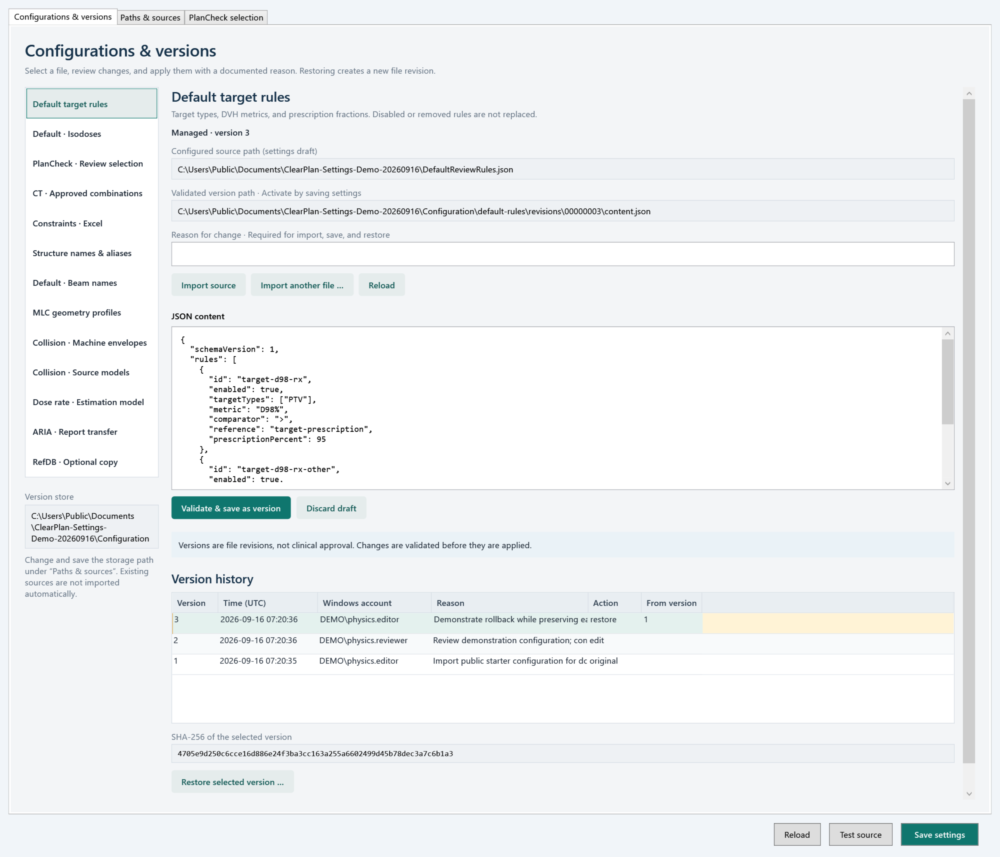
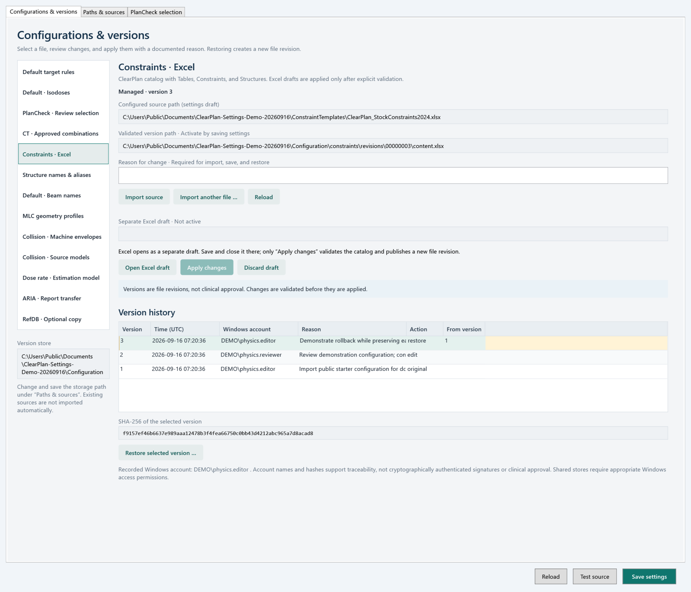
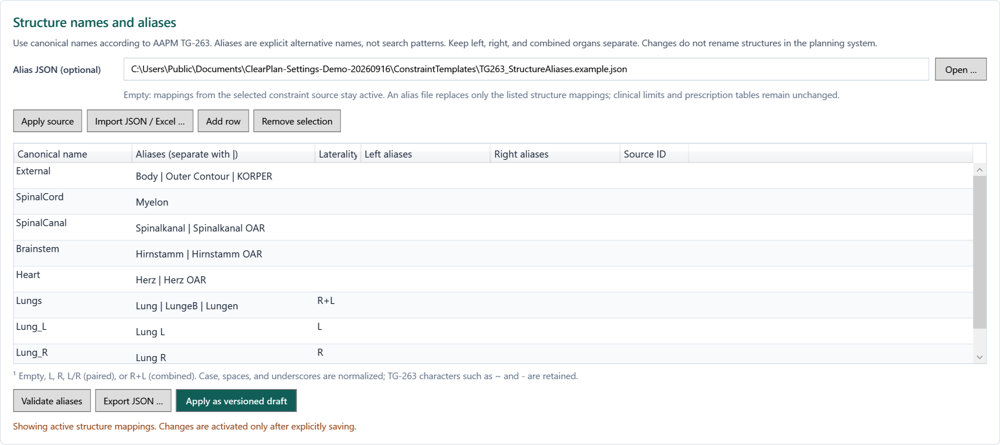

# Settings gallery

[Documentation](index.md) · [Configuration guide](configuration-guide.md) · [Configuration history](CONFIGURATION_HISTORY_STORE.md)

These are **actual English-language WPF views**, rendered at 288 DPI from the
[documented code snapshot](https://github.com/Kiragroh/ClearPlan-OpenSource/tree/98aed7bc2fb3ecbced7cc2a520f691da36c53bfa).
They use public configuration files, generated `DEMO` accounts/history, and generic
example check descriptions. No patient, anatomy, clinical report, private check
matrix, or institutional network path is included. The images are not retouched
and are not evidence of clinical validation.

## Versioned defaults

The configuration workspace displays editable target rules alongside revision
history, comparison, and restore controls. This example loads the public
[default-rule file](../ClearPlan.Script/Distribution/DefaultReviewRules.json).
The displayed actors and history entries are generated examples, not an audit of
clinical changes. Local target rules require independent review and acceptance.

## Constraint workbook history

The same workspace manages revisions of the public
[stock workbook](../ClearPlan.Script/Distribution/ConstraintTemplates/ClearPlan_StockConstraints2024.xlsx).
The demonstration illustrates file-level history and change notes; it does not
establish that a table is appropriate for a particular prescription or patient.

## Explicit structure aliases

The alias editor separates canonical names from accepted local synonyms. It uses
the public [TG-263 alias example](../ClearPlan.Script/Distribution/ConstraintTemplates/TG263_StructureAliases.example.json).
German organ aliases remain unchanged source data even when the interface is in
English; presentation translation must not rewrite structure identifiers.

[Open the original grid-detail capture](images/settings/settings-alias-grid-detail.png)
for a closer view of the editable columns.

## Check selection

The inclusion editor controls which check families are shown in review/report
scope. The six descriptions here are constructed generic examples, **not** the
private legacy PlanCheck matrix. Disabling display is not the same as preventing
the underlying legacy check engine from executing.

## Provenance and reproduction

[The provenance manifest](images/settings/provenance.json) records SHA-256 hashes,
pixel dimensions, capture DPI, source files, and public input files. Captures use
the real [Settings view](../ClearPlan.Script/Views/SettingsView.xaml) and
[configuration workspace](../ClearPlan.Script/Views/ConfigurationWorkspaceView.xaml),
not a drawn mock-up. The generic Windows Public Documents demo folder shown in
some views is not a suggested production deployment path.

To inspect the current controls interactively, follow the
[patient-free build guide](developer-handoff.md#patient-free-build-and-test).
The specific history rows and six check descriptions shown above are presentation
fixtures, not records created automatically by a fresh installation.
