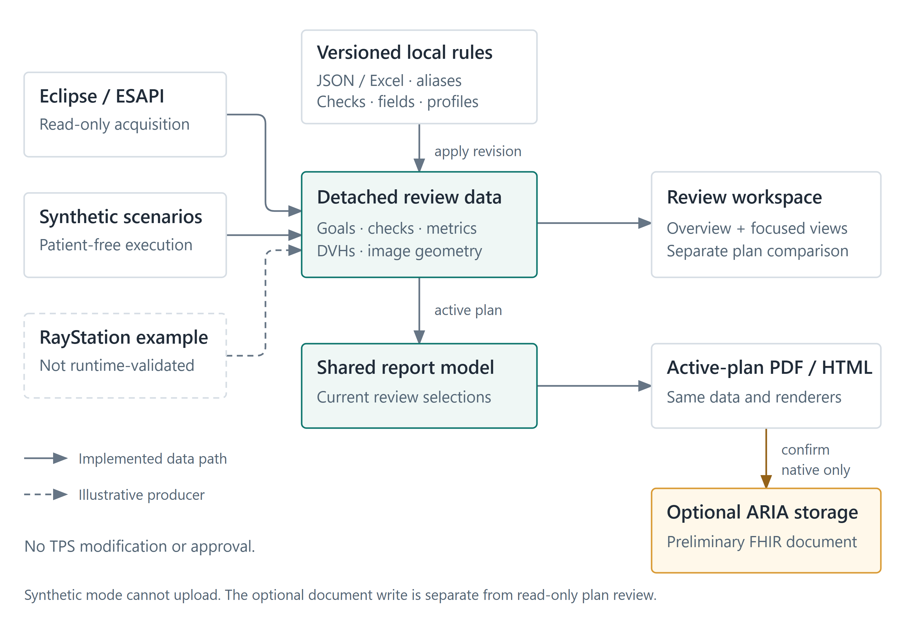
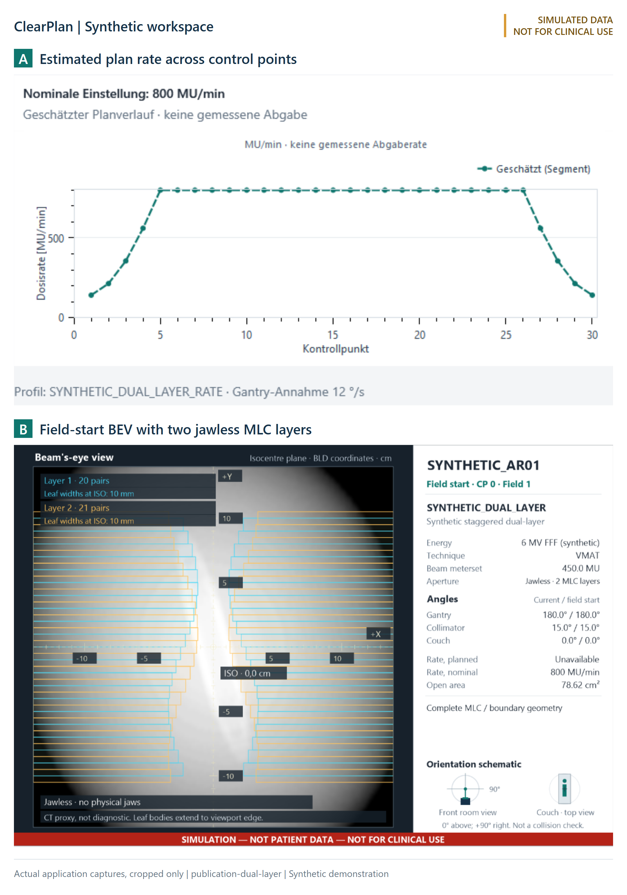

# ClearPlan configurable radiotherapy plan review with reproducible synthetic verification

Article type: Technical note

Running title: Configurable radiotherapy plan review

Maximilian Grohmann^1,2^, Maria Jäckel^2^, Manuel Todorovic^2^, Cordula Petersen^2^, Andrea Baehr^2^

^1^ University of Leipzig Medical Center, Department of Radiation Oncology, Stephanstraße 9a, Building 5.2, 04103 Leipzig, Germany

^2^ University Medical Center Hamburg-Eppendorf, Department of Radiotherapy and Radiation Oncology, Building O26, Martinistraße 52, 20246 Hamburg, Germany

Corresponding author: Maximilian Grohmann, University of Leipzig Medical Center, Department of Radiation Oncology, Stephanstraße 9a, Building 5.2, 04103 Leipzig, Germany; maximilian.grohmann@medizin.uni-leipzig.de; +49 341 97 18226; ORCID: https://orcid.org/0000-0002-6909-811X

## Abstract

Local structure names, prescription schemes, and review policies complicate the transfer of automated radiotherapy plan-checking tools between institutions. We developed ClearPlan to combine editable review rules with reproducible, patient-free verification. A detached data model links read-only Eclipse acquisition and a standalone simulator to a shared review workspace and report generator. Versioned configuration governs structure aliases, constraints, check inclusion, field nomenclature, and machine geometry. The workspace presents dose-volume histograms, target-quality indices, aperture modulation for single- and dual-layer multileaf collimators, and explicitly estimated control-point dose-rate trajectories. Optional document transfer to ARIA through Fast Healthcare Interoperability Resources is a separately confirmed write, tested here with synthetic payloads and mocked responses. Verification used 385 executable software tests, seven baseline/fault scenarios, and two analytical-phantom scenarios. Each phantom scenario produced six dose-volume histograms, seven evaluated goals, three orthogonal dose/contour views, and an 11-page report with a web-viewable companion. Numerical and state tests addressed geometry, unavailable inputs, configuration history, and context-bound document handling. The illustrative apertures did not generate the analytical phantom dose. These results establish reproducibility of specified software behaviors, not clinical error-detection performance, dose accuracy, or delivery feasibility. ClearPlan provides an inspectable starting point for local acceptance testing; adapters to other scripting-capable planning systems require separate implementation and validation.

Keywords: dose-volume histogram; plan aperture modulation; multileaf collimator; clinical goals; treatment planning systems; interoperability.

## 1. Introduction

Physics plan review combines quantitative dose assessment with checks of prescription, plan metadata, geometry, and treatment preparation. AAPM Task Group 275 and Medical Physics Practice Guideline 11.a describe structured plan and chart review [1,2],<!--ref:ford2020tg275--><!--anchor:section:1.1--><!--ref:xia2021mppg11a--><!--anchor:section:Abstract--> while Task Group 100 places quality management within a process-specific risk analysis [3].<!--ref:huq2016tg100--><!--anchor:section:1.A.2--> The value of a review check depends on the failure mode and the information available to the reviewer [4].<!--ref:gopan2016--><!--anchor:section:Abstract, Results--> A useful software aid must therefore make missing inputs and unresolved judgments visible alongside calculated results.

Sharing an in-house review application involves more than distributing executable code. Institutions use different structure names, prescription schemes, machine configurations, and review policies. TG-263 supplies a common nomenclature for structures and dosimetric quantities [5],<!--ref:mayo2018tg263--><!--anchor:section:Abstract--> but it does not remove the need for local aliases or institutional acceptance criteria. These dependencies should be editable without changing the calculation code and should remain identifiable after revision.

Automated plan-review applications already have a substantial implementation literature. Covington et al. implemented automated and manual checks using TPS and treatment-management-system data [6].<!--ref:covington2016--><!--anchor:section:Abstract--> Berry et al. evaluated a multi-institutionally developed, configurable checking tool within one institution [7].<!--ref:berry2020--><!--anchor:section:Abstract--> Chartist combines plan-attribute-based checklists, automated and manual checking, and retained operational data [8].<!--ref:clouser2025--><!--anchor:section:2.1-2.3--> Longitudinal analysis of automated flags further illustrates the importance of maintenance as clinical practice changes [9].<!--ref:stuhr2022--><!--anchor:section:Abstract, Conclusions--> ClearPlan does not claim priority for automated checks, quantitative metrics, or reporting. Its engineering contribution is their combination with controlled local configuration and a patient-free execution path that uses the same review and report components.

This technical note describes ClearPlan v3.2.0, a read-only treatment-planning-system (TPS) review workspace with an explicitly separate, optional document-transfer action. The application groups dose-volume histogram (DVH) goals, plan checks, field nomenclature, geometric plan parameters, and image context in one review. A detached data contract separates TPS acquisition from calculation, presentation, and reporting. The verification question was whether specified numerical, configuration, and interaction behaviors could be reproduced from synthetic inputs, including meaningful unavailable states. Clinical error detection, review time, and patient outcomes were not evaluated.

## 2. Materials and methods

### 2.1 Shared review, reporting, and acquisition boundaries

ClearPlan uses C# and .NET Framework 4.8. Its Eclipse adapter reads the active planning context through ESAPI [10]<!--ref:varian17--><!--anchor:section:Supported Script Types, Plug-ins; Read-Only and Write-Enabled Scripts--> and incorporates the existing PlanCheck and EsapiEssentials components [11,12].<!--ref:clarkplancheck--><!--anchor:section:README at b441f8d2da5287d8a136ed60ee97df25418cb82f--><!--ref:andesapiessentials--><!--anchor:section:README at a143c44e3c6285d2dced72d884522d1228c68ff3--> No review operation requests TPS modification permission or changes structures, fields, dose, prescriptions, or approval. Vendor-owned objects are read on their owning dispatcher. Detached numeric and rendering data can then be processed asynchronously. The independent desktop simulator requires no proprietary TPS assemblies.

A versioned review snapshot contains plans, source states, constraint results, check findings, mappings, field conformance, DVHs, and plan-analysis data. Validation checks schema, identifiers, units, finite values, and cumulative-DVH consistency. Native geometry remains detached rendering data rather than a public patient export. The shared workspace and report mapper consume this review state (Figure 1). PDF and HTML describe the active plan using the same report model and renderers. A separate comparison reference can be loaded without opening it as the active plan, and comparison values are not inserted into the single-plan report.

The interface provides an overview and focused review pages (Figure 2). Message and status lead the check table. DVH legends sit outside the plotting area and permit individual structure selection, shared with the CT views and retained across same-plan tab changes. Initial selection includes structures with resolved goals, captured TPS selections, nonempty PTVs, and at most one largest verified contained CTV, GTV, or ITV overall. Unmatched goals are hidden by default with an explicit count, while the mapping editor remains complete. Hiding a row or curve does not turn it into a passing result or change a TPS selection.

Three fixed-isocenter CT planes show structure contours and isodoses. Optional beam's-eye-view (BEV) report pages use the exact first control point, including a closed starting aperture. Their CT projection integrates a display-only attenuation proxy along divergent rays. It is not a diagnostic digitally reconstructed radiograph (DRR), an independent dose calculation, or integrated arc fluence. Unsupported image geometry is labeled unavailable. These views supply review context, not a full three-dimensional image, registration, or collision-verification system.

### 2.2 Local rules and configuration history

RefDB JSON and Excel adapters normalize structures, aliases, laterality, constraint tables, objectives, comparators, units, and source provenance into one catalog. Runtime defaults do not depend on CSV files. Automatic source mode reports fallback to a valid alternative, whereas explicitly selected sources do not switch silently. Constraint selection prioritizes compatible fractionation and the number of distinct resolved structures. Ambiguous matches remain unresolved. Canonical structure names follow the configured TG-263-oriented catalog, with local aliases maintained separately.

Defaults also cover field nomenclature and generated target rules. Field identifier and field-name conformance are independent, so a correct identifier remains marked as such when the name differs. The local arc convention places a nonzero couch token before the direction token, for example `179-181 T30 UZ`. This is not a TG-263 beam-naming rule. The shipped PTV coverage rule is strict D98% >95% of an explicitly assigned target prescription. Missing or ambiguous target prescriptions are not replaced by an inferred plan-total or containing-target dose. Users may revise or remove these defaults. Public demonstration constraints are examples, not clinical recommendations.

Settings expose source paths, aliases, defaults, check inclusion, and machine profiles. Imported files are validated copies, preserving their external originals. Each managed revision records actor, UTC time, reason, action, and SHA-256. Restoring earlier content appends a revision rather than deleting subsequent history. Activation pins an immutable committed copy and requires an explicit settings action. Stale edits and content conflicts are rejected. These records provide local provenance, not authenticated attribution or a tamper-proof approval audit. Excluding a check family from review suppresses its displayed findings, not execution of the external check engine, and excluded counts remain visible.

### 2.3 Descriptive dose and aperture metrics

Table 1 defines the numerical quantities. D_p denotes the dose received by at least p% of a structure. The target-quality panel reports the Paddick conformity index (CI) [13]<!--ref:paddick2000ci--><!--anchor:section:Abstract--> and its reciprocal [14],<!--ref:wu2003conformity--><!--anchor:section:Methods and materials B, equation 2; Figure 3b--> a gradient index (GI) [15],<!--ref:paddick2006gi--><!--anchor:section:Abstract--> and a prescription-normalized homogeneity index (HI). The HI denominator is the displayed plan prescription, not D50%. The existing EXTERNAL DVH supplies whole-plan isodose volumes without creating dose-derived structures. This GI is not lesion-specific, and the plan prescription is not an inferred simultaneous-integrated-boost prescription. Missing or inconsistent inputs leave the affected quantity unavailable.

**Table 1. Definitions and interpretation of displayed plan parameters.**

| Quantity | Definition | Scope and interpretation |
| --- | --- | --- |
| Treatment MU; MU/Gy | Σ MU of treatment beams; total MU divided by prescribed fraction dose in Gy | Setup/imaging fields excluded; incomplete MU prevents a partial plan total. |
| Plan normalization | Native TPS normalization percentage | Descriptive scalar, not an independent dose check; missing is not zero. |
| Paddick CI; reciprocal | TV_Rx²/(TV × V_Rx); 1/CI | TV is target volume, TV_Rx its volume receiving at least Rx, and V_Rx the EXTERNAL volume receiving Rx. The reciprocal is undefined when CI = 0. |
| GI | V_50%Rx/V_Rx | Existing EXTERNAL, whole plan; undefined when V_Rx = 0. |
| HI | (D2% − D98%)/Rx | Dimensionless prescription-normalized spread, not the D50-normalized variant. |
| Control-point aperture modulation | AM_j = 1 − area(T_j ∩ O_j)/area(T_j) | T_j is the target projection and O_j the effective opening. Dimensionless blocked-target fraction. |
| Beam PAM; plan PAM | MU-weighted endpoint average of AM_j; weighted mean of complete beam values | Native mode uses normalized Beam.WeightFactor; synthetic/imported mode uses beam MU. The mode is retained with the result. |
| Aperture summaries | Mean, minimum, maximum area; MU-weighted fraction below 4 cm² by default | cm² and dimensionless fraction; the displayed configurable threshold is descriptive, not a clinical limit. |

Plan aperture modulation (PAM) measures the fraction of a target projection blocked by the aperture, following the geometric definition of Hernandez et al. [16].<!--ref:hernandez2025pam--><!--anchor:section:2.2, equation 1; target-specific paragraph--> It is target-specific and is not the modulation complexity score. For each consecutive control-point interval, MU equals beam MU multiplied by the cumulative-meterset-weight increment divided by the final cumulative weight. Half the interval MU is assigned to each endpoint for aperture and PAM averaging. Zero-MU intervals receive no artificial weight. Native plan aggregation follows the locally adapted PlanCheck beam-weight-factor convention. This declared variant must not be confused with the original all-control-point MU-weighted plan average [16].<!--ref:hernandez2025pam--><!--anchor:section:2.2, equation 2--> Other MU and aperture summaries retain their stated MU weighting.

The effective opening intersects the strip openings of every physical MLC layer with real jaws, when present. Jawless fixed limits are represented separately. Explicit model profiles provide leaf boundaries and complete layer-index assignments, including staggered dual-layer geometry. Missing layers or unknown leaf widths do not become an assumed single-layer aperture or invented jaws. Moving-target projection uses the union of projected surface triangles, preserving disconnected components, with 0.625-mm raster sampling in the native calculation. The supported native envelope is head-first supine with zero fixed couch angle, fixed collimator, and fixed table translation. A beam-start comparison with the native outline must satisfy a 3% symmetric-difference/union guard before moving projections are accepted. This consistency check is not independent geometric validation.

With several eligible PTVs, automatic PAM selects the lowest complete finite result and reports valid/eligible candidate counts. Incomplete candidates are never treated as zero. An explicit target takes precedence, and an invalid explicit choice remains unresolved. The numerical minimum is not a claim that one target or plan is clinically preferable, and no TPS target assignment changes.

### 2.4 Estimated plan dose-rate trajectory

The nominal field setting in MU/min is distinct from a time-resolved rate trace. ClearPlan therefore labels its control-point calculation an *estimated plan trajectory*. For interval i, with normalized interval MU m_i, directed gantry travel Δθ_i, configured speed bound ω, and nominal rate R, the model uses

t_i = max(Δθ_i/ω, 60m_i/R), and R_i = 60m_i/t_i.

The plotted axis is control-point index, not measured time. Exact locally configured machine identifiers or qualified model combinations select the speed profile; MLC identity alone does not establish a delivery speed. Synthetic examples use explicit 6°/s and 12°/s bounds. The model omits acceleration, leaf/jaw dynamics, rate ramping, and beam holds. It can legitimately produce a constant MU-limited estimate. Missing profiles, invalid weights, or ambiguous angular travel make the estimate unavailable. It neither reconstructs delivered motion nor measures absorbed-dose rate in Gy/s.

### 2.5 Optional document transfer

FHIR DocumentReference provides a resource for describing and locating a document [17].<!--ref:hl7r4documentreference--><!--anchor:section:2.42.1--> ClearPlan's optional ARIA action creates a preliminary PDF document as a separate external write. It resolves the exact patient identifier, provider, and configured document type, then binds immutable PDF bytes and their SHA-256 to the patient and active plan. Confirmation shows these details. Changed context invalidates preparation, and privacy or synthetic mode disables the action.

Endpoint configuration and credentials remain local, with secrets outside distributed settings. HTTPS uses certificate validation or an explicitly configured endpoint binding. A durable intent precedes a single POST. An uncertain outcome is not automatically replayed, including after restart. Subsequent readback checks patient, provider, type, status, document date, and returned attachment bytes or fingerprint. Where ARIA returns only a file reference, an optional reader is restricted to explicitly configured UNC roots and verifies the PDF bytes without modifying the stored file. Missing attachment creation metadata is disclosed. Metadata-only and full attachment verification remain distinct. Storage is not plan approval. Only synthetic payload and mocked-transport tests form part of the reported study, not clinical-derived transfers.

### 2.6 Synthetic verification and reproducibility

Seven retained synthetic scenarios comprise one baseline-pass scenario and six fault/status-propagation scenarios. They separate calculated DVH/PQM deviations from injected metadata, mapping, and optional-source findings and test known status propagation, not clinical defect-detection sensitivity. Two additional publication scenarios, `publication-single-layer` and `publication-dual-layer`, use one analytical ellipsoid phantom for CT planes, contours, dose, six DVHs, and target indices. A 60-Gy, 30-fraction example contains a PTV, a contained CTV, spinal cord, paired parotids, and EXTERNAL. Structures and dose are sampled at 3-mm voxel centers with 0.1-Gy cumulative histogram bins. Goal values are recalculated from those displayed DVHs. Their illustrative D98% threshold is ≥57 Gy and is explicitly distinct from the strict native default-rule comparator.

The phantom's dimensionless target radius r defines dose as 63 − 2.4r² Gy inside the target and 60.6 exp[−3(r−1)] Gy outside. The same structures provide the first-control-point attenuation projection and target silhouette. Illustrative single- and dual-layer apertures supply PAM and rate examples, but do not calculate the phantom dose. Thus anatomical/dosimetric consistency within the fixture is specified analytically, without claiming a physically planned treatment. Its target projection uses a declared 1.25-mm demonstration raster.

Verification combines analytical scalar/rectangle oracles, numerical boundary and rejection tests, injected findings, controller-state tests, configuration integrity tests, and mocked FHIR responses (Table 2). Native engineering checks are recorded separately and are not a clinical cohort. Final reproducibility material identifies v3.2.0, its commit, configuration and fixture hashes, execution commands, and test results. The named active-plan report supplement has SHA-256 503295a385ba953d9cd17a1f490a61e9e16d051a8d2dc6d5babae6de734ab3d5. Inferential statistics are not applicable to these fixed software cases.

## 3. Results

The final frozen C# verification run contained 385 executable tests with no failures or skipped test groups. Separate runs passed 20 synthetic DICOM tests, 20 illustrative RayStation adapter tests, and nine stock-catalog parser tests. The private stock-source transcription group was unavailable in the public checkout and was explicitly skipped. Suite-level outputs and commands accompany the release rather than being interpreted as a clinical-validation score. The seven baseline/fault scenarios retained their specified calculated and injected states. The publication fixtures generated six monotone DVHs with recalculated goals, three registered isocenter planes, target-quality values, finite aperture/PAM data, and separately labeled interval-rate estimates. Both publication fixtures produced 11-page PDF reports and self-contained HTML quicklooks. Synthetic-use markings were present on every PDF page; isolated DVH exports included a right-hand curve legend and a synthetic-use notice.

**Table 2. Representative synthetic verification targets and expected oracles.**

| Feature | Numerical or state oracle | Evidence family |
| --- | --- | --- |
| Target indices | Rx = 60 Gy, TV = 100 cm³, TV_Rx = 90 cm³, V_Rx = 120 cm³, V_50%Rx = 360 cm³, D2% = 63 Gy, D98% = 57 Gy give CI = 0.675, reciprocal ≈1.4815, GI = 3, HI = 0.1. Zero/inconsistent inputs have defined unavailable states. | TargetQuality |
| Physical apertures/PAM | A jaw-clipped single layer gives 2.5 cm²; staggered jawless layers intersect to 1.5 cm² and PAM = 0.5 in the declared target fixture. Missing geometry cannot produce a complete result. | PlanAnalysis; PamBestTarget |
| Rate estimate | Sum of R_i × t_i/60 equals beam MU; direction/wrap, nonunit final weight, zero intervals, and ambiguous profiles are exercised. | DoseRateEstimator |
| Shared review state | Reference selection preserves the active plan; same-plan visibility persists; another plan cannot inherit prior context. | ReviewComparison; ReviewControl |
| Configuration | Restore appends a revision; original input remains unchanged; stale/current-hash conflicts reject edits. | ConfigurationHistory |
| Publication geometry | Contours satisfy the declared ellipsoids; isodose points satisfy the dose function; DVH volumes match the 3-mm lattice; CP0 projections use the same phantom. | SyntheticPublicationScenario |
| Document action | Exact identity/type, changed-context rejection, one POST, attachment mismatch, and unresolved receipts across restart are tested using synthetic payloads/mock responses. | AriaReportUpload; AriaFhirClient; AriaConnection |

The numerical target-index oracle uses detached scalar inputs and a 10^−9 absolute tolerance. Publication isodose-point tests allow 0.15 Gy for the declared sampling, while the demonstration perspective-area check allows 1 cm². These are test-specific software tolerances, not clinical acceptance limits. Some fixture tests deliberately recompute with shared helpers to check consistency. Independent scalar and geometric oracles provide complementary checks, but do not establish end-to-end dosimetric accuracy.

Figure 2 and Supplementary Material S1 document the synthetic review and active-plan output. The 11-page dual-layer supplement displays the PTV, its contained CTV, spinal cord, and paired parotids in the DVH. EXTERNAL supplies whole-plan isodose-volume metrics but is not plotted by default. Each CT plane and each of the two optional CP0 BEVs has its own PDF page. The report and HTML companion carry explicit synthetic-use markings. The report presents compact goals, checks, dose summaries, target indices, parameters, three image planes, and optional field-start BEVs. It contains neither clinical identity nor a comparison-plan assessment.

## 4. Discussion

ClearPlan makes local review logic and its presentation inspectable within a reproducible software package. Its practical contribution is the connection between editable rules, geometry-aware descriptive metrics, an integrated review, and a synthetic execution path. Existing systems have evaluated automation in clinical workflows [6–9],<!--ref:covington2016--><!--anchor:section:Abstract--><!--ref:berry2020--><!--anchor:section:Abstract--><!--ref:clouser2025--><!--anchor:section:Abstract; 2.1-2.3--><!--ref:stuhr2022--><!--anchor:section:Abstract, Conclusions--> whereas the present evidence concerns specified software behavior. The intended benefit is easier preparation and inspection of a local review implementation. Whether it reduces missed errors or reviewer effort requires a separate evaluation.

Several design choices address recurring interpretation problems. A matched structure with unavailable measurement remains distinct from an unmatched goal. PTV selection is shared across review domains, but its provenance remains visible. PAM reports its target and aggregation convention rather than an unexplained complexity score. Dashed styling and explicit estimate labels distinguish the calculated trace from the nominal field-rate setting; no delivered trace is inferred. Versioned configuration permits a result to be related to the active local rules. These features support investigation of a finding without giving a software status authority to approve treatment.

The contract also identifies a route to other scripting-capable TPSs. RayStation provides scripting access to planning information [18].<!--ref:raysearchscripting--><!--anchor:section:Introduction; Scripting capabilities, Automation--> The repository's illustrative producer has fake-context tests, including unit conversion and identifier omission, but no RayStation runtime or end-to-end GUI validation is claimed. Imported quantities require semantic mapping, dose-sampling verification, and local acceptance. A bounded optional RTPLAN enrichment library is separate from native ESAPI acquisition and is not a general clinical-image importer. Reusing a data contract does not establish cross-TPS equivalence.

The study is limited to synthetic software verification. Injected check findings test propagation, not detection of the corresponding clinical defect. The analytical phantom does not establish dose accuracy, delivery feasibility, or patient anatomy coverage. The native projection envelope, profile-dependent leaf geometry, target-specific PAM, whole-plan GI, and plan-Rx HI restrict interpretation outside the supported conditions. The rate model excludes several delivery constraints. Configuration hashes are not an approval system, and mocked transport tests do not establish successful operation on every ARIA deployment. Fixed-isocenter views do not replace full image review, independent dose/MU verification, measurement-based QA, or transfer-chain checks.

Local adoption therefore requires controlled machine profiles and constraints, representative test plans, independent numerical and geometric comparisons, end-to-end TPS/OIS checks, and review of missed and unnecessary alerts. TG-201 and the TG-275 failure-mode literature provide relevant quality-management context [19,20].<!--ref:siochi2021tg201--><!--anchor:section:Abstract; 4, Data transfer QA--><!--ref:riegel2022--><!--anchor:section:Abstract--> Subsequent work should quantify failure-mode coverage, false alerts, reviewer actions, and review time under a defined local workflow. Such data would test the intended utility rather than infer it from feature count or successful screenshots.

## 5. Conclusion

ClearPlan combines read-only TPS review, controlled local configuration, descriptive plan metrics, and shared PDF/HTML reporting with patient-free synthetic verification. Explicit geometry, target-selection, missing-data, and rate-estimation rules make its outputs inspectable. Optional ARIA document storage remains a separately confirmed write. The reported software tests support reproducibility of specified behaviors, not clinical effectiveness or commissioning. The release provides a basis for local acceptance work and for cautiously developing adapters to other scripting-capable TPSs.

## Figure and supplementary-material captions

**Figure 1. Shared review and controlled integration.** Eclipse/ESAPI and a deterministic synthetic producer populate detached review data. External JSON/Excel catalogs and explicitly activated configuration revisions supply local interpretation. Shared presentation and report mapping feed the review workspace and active-plan PDF/HTML. A separately confirmed FHIR branch creates a preliminary document only in eligible native mode. The dashed RayStation producer denotes an illustrative, unvalidated adapter. No acquisition arrow denotes a TPS write.

**Figure 2. Synthetic review of estimated delivery parameters and field geometry.** Actual application captures from the `publication-dual-layer` fixture in v3.2.0 show (A) the nominal field setting and estimated MU rate against control-point index, with the displayed 12 degrees/s gantry-speed assumption, and (B) the first-control-point beam's-eye view with two staggered, jawless multileaf-collimator layers, isocenter-plane coordinates, a synthetic CT proxy, and corresponding field metadata. The rate curve is an estimate, not a measured delivery trace. All anatomy and values are synthetic; the aperture geometry does not generate the analytical dose. The GUI labels are retained as captured. These views illustrate the available review context, not clinical performance or measured usability.

**Supplementary Material S1. ClearPlan synthetic dual-layer plan review.** Active-plan PDF with an HTML quick-look companion, generated from `publication-dual-layer`. It includes goals, findings, dose/target metrics, plan parameters, three isocenter planes, and optional CP0 BEVs. The synthetic mode, analytical-dose/aperture separation, configuration, visibility settings, exact generation command, and artifact hash are provided with the release. The supplement contains no patient source data and is not a treatment report for clinical use.

## Declarations

### Ethics approval and consent to participate

This software study reports exclusively analytically generated synthetic scenario artifacts. The reported study artifacts include no patient records, clinical datasets, patient-identifiable information, or human-participant observations. Ethics approval and informed consent were therefore not applicable.

### Consent for publication

Not applicable. The figures and reported values were generated from repository-controlled synthetic sources. Figure 1 is an architecture diagram, and Figure 2 and Supplementary Material S1 use the named synthetic publication fixture.

### Availability of data and materials

No clinical dataset is included in the repository or reproducibility materials. Source, synthetic fixtures, example configuration, test code, figure/report generation instructions, and reproducibility records corresponding to this manuscript are linked to ClearPlan v3.2.0 [21].<!--ref:clearplanrelease--><!--anchor:release:v3.2.0--> Verified software source commit: ca3e381813489542bae4551db9db23c8c3da23d8. The versioned release additionally contains the manuscript and publication artifacts generated from that software revision. Public release URL: https://github.com/Kiragroh/ClearPlan-OpenSource/releases/tag/v3.2.0. The software archive inventory and Supplementary Material S1 SHA-256 503295a385ba953d9cd17a1f490a61e9e16d051a8d2dc6d5babae6de734ab3d5 are recorded with the release.

### Funding

This research did not receive any specific grant from funding agencies in the public, commercial, or not-for-profit sectors.

### Competing interests

The authors declare no competing interests.

### Author contributions

Maximilian Grohmann: Conceptualization, Methodology, Software, Validation, Investigation, Visualization, Writing – original draft, Writing – review and editing, Project administration. Maria Jäckel: Conceptualization, Methodology, Validation, Writing – original draft, Writing – review and editing. Manuel Todorovic: Methodology, Validation, Writing – review and editing. Cordula Petersen: Validation, Writing – review and editing. Andrea Baehr: Conceptualization, Methodology, Supervision, Writing – original draft, Writing – review and editing. All authors are accountable for their stated contributions; approval of the exact submitted version will be documented before journal submission.

### Acknowledgments

None.

### Declaration of generative AI and AI-assisted technologies in the writing process

During preparation of this manuscript and the associated software documentation, the authors used OpenAI ChatGPT/Codex to assist with language editing, repository review, drafting, and software-test development. The authors take responsibility for the manuscript and associated software documentation. No generative-image system was used; the figures are application captures or code-generated diagrams from repository-controlled inputs.

## References

1. Ford E, Conroy L, Dong L, de Los Santos LF, Greener A, Gwe-Ya Kim G, et al. Strategies for effective physics plan and chart review in radiation therapy: Report of AAPM Task Group 275. Med Phys. 2020;47(6):e236–72. https://doi.org/10.1002/mp.14030
2. Xia P, Sintay BJ, Colussi VC, Chuang C, Lo YC, Schofield D, et al. Medical Physics Practice Guideline (MPPG) 11.a: Plan and chart review in external beam radiotherapy and brachytherapy. J Appl Clin Med Phys. 2021;22(9):4–19. https://doi.org/10.1002/acm2.13366
3. Huq MS, Fraass BA, Dunscombe PB, Gibbons JP Jr, Ibbott GS, Mundt AJ, et al. The report of Task Group 100 of the AAPM: Application of risk analysis methods to radiation therapy quality management. Med Phys. 2016;43(7):4209–62. https://doi.org/10.1118/1.4947547
4. Gopan O, Zeng J, Novak A, Nyflot M, Ford E. The effectiveness of pretreatment physics plan review for detecting errors in radiation therapy. Med Phys. 2016;43(9):5181–7. https://doi.org/10.1118/1.4961010
5. Mayo CS, Moran JM, Bosch W, Xiao Y, McNutt T, Popple R, et al. American Association of Physicists in Medicine Task Group 263: Standardizing nomenclatures in radiation oncology. Int J Radiat Oncol Biol Phys. 2018;100(4):1057–66. https://doi.org/10.1016/j.ijrobp.2017.12.013
6. Covington EL, Chen X, Younge KC, Lee C, Matuszak MM, Kessler ML, et al. Improving treatment plan evaluation with automation. J Appl Clin Med Phys. 2016;17(6):16–31. https://doi.org/10.1120/jacmp.v17i6.6322
7. Berry SL, Zhou Y, Pham H, Elguindi S, Mechalakos JG, Hunt M. Efficiency and safety increases after the implementation of a multi-institutional automated plan check tool at our institution. J Appl Clin Med Phys. 2020;21(4):51–8. https://doi.org/10.1002/acm2.12845
8. Clouser EL Jr, Chen Q, Harrington DP, Rong Y, Buckey CR. Development of a hybrid automated chart checking, data collection, and analysis system. J Appl Clin Med Phys. 2025;26(7):e70161. https://doi.org/10.1002/acm2.70161
9. Stuhr D, Zhou Y, Pham H, Xiong JP, Liu S, Mechalakos JG, et al. Automated plan checking software demonstrates continuous and sustained improvements in safety and quality: a 3-year longitudinal analysis. Pract Radiat Oncol. 2022;12(2):163–9. https://doi.org/10.1016/j.prro.2021.09.014
10. Varian Medical Systems. About the Eclipse Scripting API, version 17.0. Varian Innovation Center Documentation Hub. https://docs.developer.varian.com/articles/17.0/04_About_the_Eclipse_Scripting_API.html (accessed September 11, 2026).
11. Clark L. PlanCheck [computer software]. GitHub; 2023. Reference snapshot b441f8d2da5287d8a136ed60ee97df25418cb82f. https://github.com/LDClark/PlanCheck/tree/b441f8d2da5287d8a136ed60ee97df25418cb82f (accessed September 11, 2026).
12. Anderson C. EsapiEssentials [computer software]. GitHub; 2020. Reference snapshot a143c44e3c6285d2dced72d884522d1228c68ff3. https://github.com/redcurry/EsapiEssentials/tree/a143c44e3c6285d2dced72d884522d1228c68ff3 (accessed September 11, 2026).
13. Paddick I. A simple scoring ratio to index the conformity of radiosurgical treatment plans. Technical note. J Neurosurg. 2000;93 Suppl 3:219–22. https://doi.org/10.3171/jns.2000.93.supplement_3.0219
14. Wu QR, Wessels BW, Einstein DB, Maciunas RJ, Kim EY, Kinsella TJ. Quality of coverage: Conformity measures for stereotactic radiosurgery. J Appl Clin Med Phys. 2003;4(4):374–81. https://doi.org/10.1120/jacmp.v4i4.2506
15. Paddick I, Lippitz B. A simple dose gradient measurement tool to complement the conformity index. J Neurosurg. 2006;105 Suppl:194–201. https://doi.org/10.3171/sup.2006.105.7.194
16. Hernandez V, Lara-Aristimuño I, Abella R, Saez J. Quantification of the aperture modulation in radiotherapy treatment plans. Med Phys. 2025;52(12):e70144. https://doi.org/10.1002/mp.70144
17. Health Level Seven International. FHIR R4, version 4.0.1: DocumentReference. https://hl7.org/fhir/R4/documentreference.html (accessed September 11, 2026)
18. RaySearch Laboratories AB. Scripting in RayStation [white paper]. https://www.raysearchlabs.com/media/publications/white-papers/scripting-in-raystation/ (accessed September 11, 2026).
19. Siochi RA, Balter P, Bloch CD, Santanam L, Blodgett K, Curran BH, et al. Report of Task Group 201 of the American Association of Physicists in Medicine: Quality management of external beam therapy data transfer. Med Phys. 2021;48(6):e86–114. https://doi.org/10.1002/mp.14868
20. Riegel AC, Polvorosa C, Sharma A, Baker J, Ge W, Lauritano J, et al. Assessing initial plan check efficacy using TG 275 failure modes and incident reporting. J Appl Clin Med Phys. 2022;23(6):e13640. https://doi.org/10.1002/acm2.13640
21. Grohmann M, ClearPlan contributors. ClearPlan, v3.2.0 [computer software]. GitHub; 2026. https://github.com/Kiragroh/ClearPlan-OpenSource/releases/tag/v3.2.0
