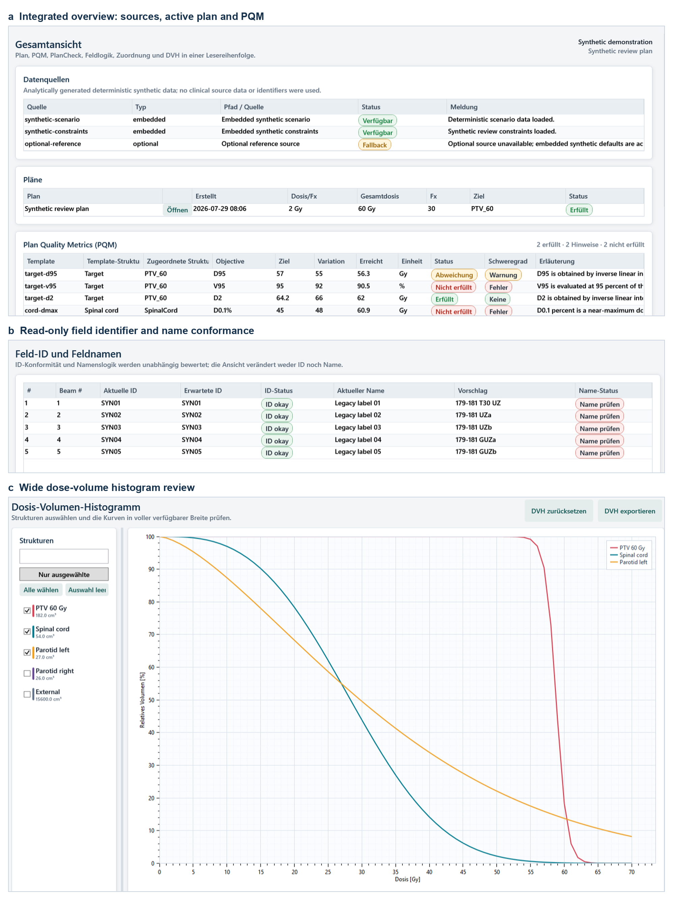
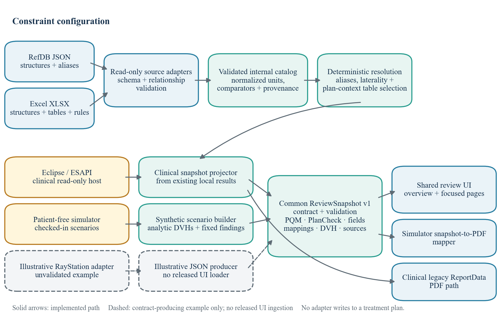
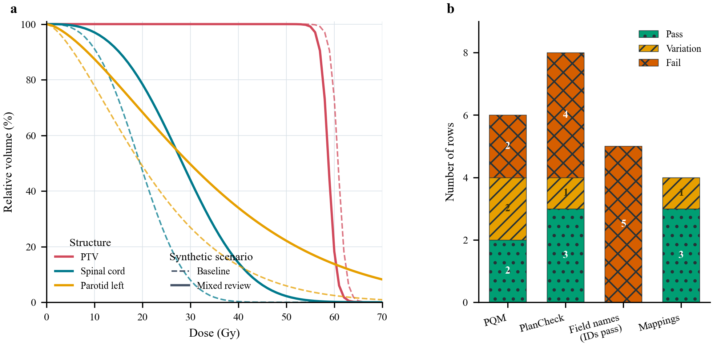

# ClearPlan: a simulator-backed contract for reproducible verification of radiotherapy plan-review software

Article type: Short Communication (technical note)

Running title: Simulator-backed review verification

Maximilian Grohmann^1,2^, Maria Jäckel^2^, Manuel Todorovic^2^, Cordula Petersen^2^, Andrea Baehr^2^

^1^ University of Leipzig Medical Center, Department of Radiation Oncology, Stephanstraße 9a, Building 5.2, 04103 Leipzig, Germany

^2^ University Medical Center Hamburg-Eppendorf, Department of Radiotherapy and Radiation Oncology, Building O26, Martinistraße 52, 20246 Hamburg, Germany

Corresponding author: Maximilian Grohmann, University of Leipzig Medical Center, Department of Radiation Oncology, Stephanstraße 9a, Building 5.2, 04103 Leipzig, Germany; maximilian.grohmann@medizin.uni-leipzig.de; +49 341 97 18226; ORCID: https://orcid.org/0000-0002-6909-811X

## Abstract

ClearPlan is a simulator-backed framework built around a vendor-neutral contract for reproducible verification of radiotherapy pretreatment-review software. It addresses a practical barrier to sharing in-house review software: clinical rules, structure names, and vendor interfaces vary, while publicly shareable regression and training material should contain no patient data. ClearPlan separates read-only treatment-planning-system (TPS) acquisition, external machine-readable or spreadsheet rule sources, a schema-validated review snapshot, and shared user-interface components and report types. The snapshot combines plan quality metrics (PQMs), PlanCheck findings, field-identifier and field-name conformance, structure mappings, source status, and dose-volume histogram (DVH) curves. A deterministic desktop simulator exercises the shared presentation and simulator-report components without proprietary TPS assemblies. Seven versioned synthetic scenarios represent passing controls and intentional target, organ-at-risk, metadata, field-name, mapping, and optional-source deviations. In the integrated mixed scenario, the declared row states comprised two PQM passes, two variations, and two failures; three PlanCheck passes, one variation, and four deliberately injected failures; five conforming field identifiers with five nonconforming names; and one ambiguous mapping. All 125 executable core tests passed. Twenty additional tests passed for an illustrative, unvalidated RayStation snapshot adapter, and one fake-context Python export passed the C# contract validator without issues. These results establish deterministic software behavior and reproducible fault presentation, not clinical sensitivity, specificity, efficiency, treatment approval, or safety benefit. The contract supplies public pre-commissioning and regression fixtures that complement, but cannot replace, local acceptance, commissioning, and end-to-end tests. It also provides a basis for developing contract-compatible read-only adapters in other scripting-capable TPSs.

Keywords: radiotherapy; plan review; quality assurance; software testing; treatment planning system; simulation

## 1. Introduction

Initial physics plan and chart review is an important quality-control step before treatment that can help prevent errors from reaching patients. AAPM Task Group 275 describes strategies for effective plan and chart review, while Task Group 100 frames quality management around prospective, process- and clinic-specific risk analysis [1,2]. Medical Physics Practice Guideline 11.a further provides minimum-practice recommendations for structured plan and chart review, including who should review which items and when [3]. Task Group 201 addresses the wider quality-management chain for transfer of external-beam treatment data [21]. These recommendations define the purpose of review, but their local implementation still depends on treatment techniques, information systems, naming practices, and institutional policy.

Pretreatment review does not intercept every planning error. Studies based on incident and near-miss pathways found that its potential value varies across failure modes [4,5]. Quantitative plan-quality metrics make target coverage and organ-at-risk dose objectives explicit and can support dosimetric plan-quality assessment [6]. Automated integrity verification can also reduce the number of repetitive comparisons that must be performed manually [7]. Automation therefore has a plausible role as a review aid, but a software pass status cannot replace professional judgment.

Reusable automation requires both standardized concepts and controlled local adaptation. AAPM Task Group 263 provides standardized nomenclature for structures and dosimetric concepts [8]. Field naming, prescription conventions, aliases, and acceptance thresholds nevertheless remain local. Existing automated plan-review systems have demonstrated configurable checks and clinical implementation [9–11,22], longitudinal surveillance of automated flags [23], and risk-based mapping against TG-275 failure modes [24]. The more recent Chartist system combines automated and manual chart-check tasks with a configurable interface and retained operational data [25], while ORBIT-RT illustrates a TPS-independent route for knowledge-based dosimetric quality control [12]. These systems address adjacent clinical implementation and surveillance questions. The distinct scope here is a public software contract with checked-in patient-free fixtures for deterministic fault injection and shared presentation; it is not a claim of priority or superior clinical performance.

**Table 1. Positioning relative to the closest cited plan-review work.**

| Work | Primary evidence | Main emphasis | Relation to the present study |
| --- | --- | --- | --- |
| Automated plan-check implementations [9–11,22] | Clinical implementation and workflow evaluation | Configurable automated checks in local TPS/OIS workflows | Establishes the clinical automation context; ClearPlan does not repeat clinical performance evaluation |
| Stuhr et al. [23] | Three-year retrospective longitudinal analysis | Flag maintenance, changing practice, and warning surveillance | Motivates post-deployment surveillance, which is outside the present synthetic study |
| Riegel et al. [24] | TG-275 failure-mode and incident-reporting crosswalk | Risk coverage of the wider initial-plan-check process | Defines a coverage method; the seven ClearPlan scenarios are not a complete risk inventory |
| Chartist [25] | Deployed hybrid platform and operational data | Automated and manual tasks, configurable UI, and retained review data | Closest platform-level comparator; ClearPlan instead verifies a public contract and patient-free fixtures |
| ClearPlan v3.1.0 | Fixed synthetic executable cases | Multi-domain snapshot, traceable row states, shared presentation, and vendor-free release gate | Verifies software reproducibility only; no clinical effectiveness or cross-TPS equivalence claim |

Governance remains necessary after automation is introduced. Software alerts are common during linear-accelerator treatment delivery [13], and recent discussion of full automation emphasizes validation and retained human oversight [14]. A review tool should therefore show what was evaluated, the observed and expected values, the source of the applicable rule, and any unresolved mapping. It should also permit regression testing without clinical data.

We developed ClearPlan around one technical proposition: a vendor-neutral review snapshot and deterministic simulator can make a multi-domain pretreatment-review application reproducible without claiming that rules are clinically interchangeable across institutions or TPSs. The framework contributes (i) a shared surface that exposes PQMs, PlanCheck, field conformance, structure mappings, and DVHs with their statuses and values; (ii) normalized external rule sources with explicit fallback behavior; (iii) a patient-free simulator with versioned fault scenarios; and (iv) a read-only adapter boundary implemented for Eclipse and illustrated, without runtime validation, for RayStation. The verification question was whether one vendor-free release could reproduce all declared scenario states, interface captures, and simulator reports from checked-in inputs while keeping unmapped cross-TPS judgments explicitly unevaluated. This technical note describes the architecture and synthetic software verification of ClearPlan v3.1.0.

## 2. Materials and methods

### 2.1 Software architecture and review contract

ClearPlan is implemented in C# for .NET Framework 4.8. The Eclipse-facing application uses the Eclipse Scripting Application Programming Interface (ESAPI) to read the current planning context [15]. Source-independent logic is separated into `ClearPlan.Core`; the shared Windows Presentation Foundation review workspace is contained in `ClearPlan.Presentation`; and reporting objects and PDF rendering are contained in dedicated reporting projects. The desktop simulator references these shared projects but contains no ESAPI or other TPS-vendor assembly reference. Licensed vendor assemblies are not distributed.

The clinical application retains the existing PlanCheck component and EsapiEssentials runner integration [16,17]. ClearPlan projects their read-only results into a versioned `ReviewSnapshot` rather than reimplementing every clinical check in the shared presentation layer. Snapshot schema version 1 contains source states, available plans, PQM rows, PlanCheck rows, field rows, structure mappings, DVH series, and report metadata. Stable identifiers link rows and structures. Validation rejects unsupported schemas, duplicate identifiers, missing active plans, invalid status or unit codes, nonfinite doses, nonmonotonic dose axes, increasing cumulative-volume curves, and text containing absolute/private paths or DICOM-UID-like values.

Each visible finding carries a status and, where applicable, an observed value, expected value, unit, and explanatory text. The shared workspace presents all review domains in one scrollable overview while retaining focused pages for PQM mapping, PlanCheck details, field conformance, and DVH selection. The simulator maps the validated snapshot to its synthetic PDF report. The clinical host retains its existing `ReportData` PDF path. Guarded refresh and rollback are designed to preserve the last valid visible review if recalculation or snapshot refresh fails; controller behavior and the source-level transaction boundary were tested outside the clinical TPS runtime. `Pass`, `variation`, and `fail` are rule-row states only: they never constitute plan disposition, treatment approval, or completion of the physicist's review. A pass meets the displayed goal or expected value; a variation lies in the displayed review band or marks a resolvable deviation; a failure exceeds the displayed failure threshold or violates the expected state. Local procedures must define acknowledgment, escalation, and resolution.

ClearPlan intentionally covers a software-assisted subset of initial physics review. It does not provide complete chart or oncology-information-system review, independent dose or monitor-unit verification, patient-specific measurement QA, TPS-to-OIS or treatment-unit transfer verification, or three-dimensional assessment of dose, images, contours, and registrations. These tasks remain within the institution's wider quality-management program.

**Figure 1.** Composite of actual ClearPlan simulator captures for the deterministic `mixed-review` scenario. (a) The integrated overview shows the synthetic-use label, source state, plan summary, PQM results, and resolved structures. (b) The field page separates identifier from name conformance. (c) The DVH page uses the available content width. The implemented German labels are retained; key translations are *Übersicht*, overview; *Feldnamen*, field names; *Dosis-Volumen-Histogramm*, dose-volume histogram; and *Gesamtansicht*, overall review. Panel callouts are in English. No patient or user identifiers are displayed.

### 2.2 External rule sources and deterministic resolution

PQM rules are loaded through read-only adapters for a structured reference-database JSON file (RefDB) or an Excel workbook. Both adapters populate the same internal catalog of canonical structures, aliases, laterality, constraint tables, normalized objectives, comparators, units, provenance, and validation issues. The public workbook uses three data worksheets—`Structures`, `Tables`, and `Constraints`—plus a `README` worksheet. CSV files are supported only as migration input and are not runtime defaults.

Source mode can be set to `Automatic`, `RefDb`, or `Excel`. Automatic mode attempts a valid RefDB source first and exposes the Excel fallback and diagnostic state if the preferred source is unavailable or invalid. Explicit modes do not switch sources silently. Network-backed source access is bounded, and a failed validated workspace refresh leaves the last valid workspace visible. Paths are stored in an editable `settings.ini`; nonpath options remain in `settings.json`.

Structure matching first resolves the catalog definition and then applies normalized requested name, canonical name, aliases, laterality-specific aliases, codes, and configured DICOM-type fallback in that order. Laterality is retained, and equal-confidence matches are reported as ambiguous rather than resolved by row order. Table selection first removes incompatible plan type and fractionation candidates, then considers dose ranges, structure coverage, and optional site or regime hints. Ties require confirmation.

Field conformance is a read-only implementation of the local PlanFieldNamer convention and is separate from TG-263 nomenclature. Field identifiers and names receive independent statuses, allowing a conforming identifier to be shown as `ID okay` even when its name differs. Static beams use rounded gantry angle; arcs use rounded start and stop angles followed by `UZ` or `GUZ`. A nonzero couch token is placed immediately before the direction token, as in `179-181 T30 UZ`. Duplicate arcs receive attached suffixes, for example `179-181 UZa`, `179-181 UZb`, `179-181 GUZa`, and `179-181 GUZb`. The adapter proposes values but contains no plan-modification, beam-renaming, setup-field, apply, or save operation.

**Table 2. Distribution boundary and local responsibilities.**

| Component | Supplied by release | Required locally before clinical use | Evidence in this study |
| --- | --- | --- | --- |
| Public simulator | Vendor-free executable, seven scenarios, example workbook, tests, captures, and synthetic PDF | None for demonstration; local rules must not be inferred from examples | Clean build, deterministic scenarios, interface/report smoke tests |
| Eclipse clinical host | Source, shared contract/presentation, ESAPI-facing adapter, and deployment template | Licensed vendor dependencies, approved local settings and rules, controlled build, workstation acceptance, end-to-end commissioning, change control | Source/contract tests and internal deployment dry run; no clinical-effectiveness study |
| Additional TPS adapter | Snapshot schema and illustrative RayStation producer | Runtime/API validation, unit and semantic mapping, confidential-data controls, a consumer integration, local acceptance and surveillance | Fake-context producer tests only; no RayStation runtime or end-to-end consumer |

**Figure 2.** ClearPlan architecture. RefDB JSON and Excel adapters populate a validated internal catalog. Eclipse/ESAPI and the patient-free simulator use separate builders to populate the common vendor-neutral `ReviewSnapshot` contract; shared validation and presentation follow. The simulator uses a snapshot-to-report mapper, whereas the clinical host retains its existing `ReportData` PDF path. Solid arrows denote implemented software paths; they do not imply completed site-specific clinical runtime commissioning. The dashed RayStation path is an illustrative, unvalidated snapshot producer rather than an established clinical implementation; the released simulator does not import arbitrary adapter JSON. None of the adapters writes to a treatment plan.

### 2.3 Deterministic synthetic scenarios

The simulator uses seven checked-in JSON scenarios: `baseline-pass`, `target-underdose`, `oar-overdose`, `metadata-plancheck`, `field-and-mapping`, `optional-path-fallback`, and `mixed-review`. Their `seed` metadata fields are fixed at 1101–1107, but no pseudorandom generation is used. Every file declares itself synthetic and contains a fixed generation time, generic display labels, source states, one synthetic plan, six PQM rows, eight PlanCheck rows, five fields, four structure mappings, and five cumulative relative DVH series. Each DVH contains 71 samples from 0 to 70 Gy.

Synthetic curves are generated analytically from hard-coded scenario parameters. The checked-in scenarios contain no CT image, contour, dose grid, DICOM unique identifier, patient record, or person identifier. Displayed volume-at-dose values use linear interpolation, dose-at-volume values use inverse linear interpolation, and mean dose uses trapezoidal integration of the cumulative DVH. The synthetic near-maximum dose example is `D0.1%[Gy]`, the dose received by the hottest 0.1% of the sampled relative volume; it is not a point maximum. Values are rounded to one decimal place, away from zero at midpoint values, before comparison with the declared goal and variation thresholds. For the 60-Gy synthetic prescription, the six objectives and goal/variation limits are `D95%[Gy]` ≥57.0/55.0, `V95%[%]` ≥95.0/92.0 where 95% denotes prescription dose, `D2%[Gy]` ≤64.2/66.0, `D0.1%[Gy]` ≤45.0/48.0, `Mean[Gy]` ≤26.0/36.0, and `V30Gy[%]` ≤50.0/60.0.

The scenarios separate calculated and injected behavior. PQM values and classifications are recalculated from the sampled DVHs. Field suggestions are generated by the tested naming logic. PlanCheck deviations, mapping ambiguity, and optional-source fallback are intentional scenario inputs and are labeled as synthetic. `baseline-pass` acts as the control. The two dose scenarios shift the target or organ-at-risk curves; the metadata scenario injects four failures and one variation; the field scenario keeps all five identifiers conforming while making all five names nonconforming and one mapping ambiguous. `mixed-review` combines these deviations for figures and report inspection.

### 2.4 Verification

The executable C# harness contained 125 functional and contract tests. The suite covered constraint normalization and validation; RefDB and Excel parsing; source precedence and explicit-mode behavior; alias and laterality resolution; table selection; PQM mapping; field naming; DVH selection; snapshot schema and privacy validation; report mapping and PDF creation; responsive layout; scenario determinism and expected statuses; simulator commands and local output restrictions; editable settings; bounded path failures; conservative PQM visibility defaults; interpolation and threshold boundaries; invalid DVH input; and last-good workspace behavior. Separate PowerShell guards inspected privacy, read-only boundaries, clinical transaction structure, package contents, and assembly dependencies; the simulator smoke test exercised layout, captures, DVH export, and PDF generation. The checked-in scenario files were compared with regenerated factory output, and PQM values and statuses were independently recomputed from their DVHs.

Release acceptance required zero failures in the 125 C# and 20 fake-context Python tests; successful C# deserialization and validation of a deterministic Python-produced adapter snapshot; exact declared row and status totals for all seven scenarios; valid monotone DVHs; byte equality between checked-in scenarios and regenerated factory output; byte-identical repeated captures; a watermarked synthetic PDF; and byte-identical ZIP hashes from two consecutive package builds. Interpolation endpoints, exact goal and variation boundaries, invalid curves, unavailable PQMs, and valid numerical zero values were exercised explicitly. A requirements–hazards–scenarios–oracles–evidence matrix and the clean public build command are provided with the release. Inferential statistics were not applicable because the study exhaustively reports fixed deterministic software cases rather than a sampled population.

The public Excel workbook was validated separately for required worksheets and relationships. It contained three tables, 19 constraints, and seven structures. These are deliberately nonclinical examples and do not constitute recommended treatment constraints.

TPS adaptability was examined at the contract level. RayStation supports scripting and access to planning information [18], while DICOM RT defines standardized radiotherapy information objects [19]. The repository therefore includes an illustrative Python adapter targeting the documented shape of RayStation v2025 SP2 scripting API 17.2.0. It reads the current context, converts cGy to Gy, pseudonymizes structure roles, and writes a non-UNC `ReviewSnapshot`. It queries five current context objects and omits patient, plan, beam, region-of-interest, and DICOM identifiers. The resulting dosimetric and geometric content nevertheless remains confidential clinical data and is not made public. All transcribed PQMs, field conformance rows, and PlanCheck rows remain `not-evaluated` when semantic equivalence has not been established. Twenty fake-context tests cover deterministic output, units, rejection of out-of-range or nonmonotone DVHs, transcription of the adapter's currently handled goal types, output-path restrictions, lazy API import, identifier omission, and an abstract-syntax-tree ban on write-like RayStation calls. A deterministic fake-context Python export was additionally deserialized and accepted with zero issues by the C# `ReviewSnapshot` validator. The adapter currently writes JSON, whereas the released simulator accepts only its embedded synthetic scenarios; no end-to-end RayStation-to-ClearPlan user-interface route is claimed. No RayStation runtime-execution evidence is included, and the adapter has not been commissioned. No DICOM importer or DICOM-import evaluation is included in the repository.

## 3. Results

### 3.1 Synthetic scenario verification

All seven scenario files passed schema, determinism, privacy-label, DVH monotonicity, and expected-status tests. Table 3 summarizes the intentional condition in each scenario. These are deterministic software cases, not observations of clinical error prevalence.

**Table 3. Versioned synthetic scenarios, oracle type, and declared review behavior.**

| Scenario | Oracle type | Intentional behavior |
| --- | --- | --- |
| `baseline-pass` | Calculated PQMs plus fixed expected rows | Six PQMs, eight PlanCheck rows, five field identifiers, five field names, and four mappings pass. |
| `target-underdose` | DVH-derived calculation | PQM distribution: four pass, one variation, one fail. |
| `oar-overdose` | DVH-derived calculation | PQM distribution: four pass, one variation, one fail. |
| `metadata-plancheck` | Deliberately injected fixed findings | PlanCheck distribution: three pass, one variation, four fail. |
| `field-and-mapping` | Naming calculation plus deliberate mismatch | All five identifiers pass; all five names fail; three mappings pass and one is a variation. |
| `optional-path-fallback` | Deliberately injected source state | An optional source reports fallback while embedded synthetic defaults remain active. |
| `mixed-review` | Combined calculated and injected oracles | Target, organ-at-risk, metadata, field-name, mapping, and source-fallback conditions are combined. |

The `mixed-review` snapshot contained three sources, of which two were available and one used an optional fallback. Its six PQM values were `D95%[Gy]` = 56.3 Gy (variation), `V95%[%]` = 90.5% (fail), `D2%[Gy]` = 62.0 Gy (pass), spinal-cord `D0.1%[Gy]` = 60.9 Gy (fail), left-parotid `Mean[Gy]` = 32.9 Gy (variation), and left-parotid `V30Gy[%]` = 49.6% (pass). Table 4 reports the corresponding row counts. All five field identifiers conformed, while the five proposed names were `179-181 T30 UZ`, `179-181 UZa`, `179-181 UZb`, `179-181 GUZa`, and `179-181 GUZb`.

**Table 4. Status distribution in the deterministic `mixed-review` scenario.**

| Review domain | Pass | Variation | Fail | Total |
| --- | ---: | ---: | ---: | ---: |
| PQM | 2 | 2 | 2 | 6 |
| PlanCheck | 3 | 1 | 4 | 8 |
| Field identifier | 5 | 0 | 0 | 5 |
| Field name | 0 | 0 | 5 | 5 |
| Structure mapping | 3 | 1 | 0 | 4 |

**Figure 3.** Deterministic comparison derived exclusively from checked-in synthetic JSON. (a) Dashed curves show the `baseline-pass` target, spinal-cord, and left-parotid DVHs; solid curves show the corresponding `mixed-review` curves. (b) Stacked counts show PQM classifications derived from the synthetic curves and the declared PlanCheck, field-name, and structure-mapping states. PlanCheck deviations were intentionally injected; all five field identifiers passed and are not plotted. The figure demonstrates reproducible scenario behavior and does not represent a patient cohort.

### 3.2 Executable checks and shared outputs

All 125 C# tests completed with zero failures. All 20 tests of the illustrative RayStation adapter also completed with zero failures, and a deterministic fake-context export passed C# deserialization and contract validation with zero issues. These checks do not establish RayStation runtime compatibility or user-interface integration. The public workbook validator reported three tables, 19 constraints, and seven structures.

The mixed scenario populated the same shared review view model used by the clinical host and the simulator-specific snapshot report mapper. The clinical host routes report requests through its legacy `ReportData` path. The overall review displayed all five review domains, a visible optional-source fallback, five DVH series with three initially selected, and the synthetic-use banner. The focused PQM page retained the selected structure in the visible mapping table; the field page separated identifier from name status; the DVH page used the available content width; and the simulator report action produced a watermarked synthetic PDF. Figure 1 is a direct simulator capture rather than a reconstructed user-interface mock-up.

## 4. Discussion

ClearPlan’s technical contribution is the combination of externalized rule configuration, a multi-domain review contract, a shared traceable presentation, and patient-free deterministic fault injection. Existing automated plan-check systems have reported feasibility and workflow outcomes in their respective evaluated clinical settings [9–11,22,23,25]. ClearPlan does not repeat those implementation-specific evaluations. Instead, it supplies a reproducible way to exercise status calculation, mappings, user-interface state, and report output before a site introduces its own commissioned criteria.

The simulator changes what can be reviewed outside a TPS. A developer can reproduce a target-coverage deviation, an organ-at-risk deviation, a missing metadata item, a conforming field identifier with a nonconforming name, an ambiguous structure alias, or an optional network-source fallback without opening a patient. The same scenario can be used for regression tests, training material, screenshots, and report inspection. Because expected states are explicit and PQMs are recalculated from the checked-in curves, a displayed result can be traced to a rule and an input rather than accepted as an opaque flag.

TPS adaptability in this work means reuse of the snapshot, validation, presentation, and reporting boundary; it does not mean that clinical rules transfer automatically. The Eclipse adapter reads ESAPI objects and projects existing locally implemented PlanCheck and PQM results. The RayStation example demonstrates only that a second adapter can populate the contract under fake-context tests; it deliberately withholds pass/fail judgments when the clinical meaning has not been mapped and commissioned. A future DICOM RT adapter could provide another acquisition route, but DICOM objects alone do not guarantee equivalent TPS dose sampling, plan-state semantics, structure interpretation, or institutional workflow checks. Consequently, neither the RayStation example nor a hypothetical DICOM path should be described as clinically equivalent to the Eclipse implementation.

The approach complements, rather than replaces, dosimetric quality-control platforms such as ORBIT-RT [12]. ORBIT-RT provides TPS-independent comparison of submitted clinical DVHs with knowledge-based predicted DVHs, whereas ClearPlan’s snapshot coordinates heterogeneous rule-based review domains and their explanations. ClearPlan also shares the reproducibility rationale of other open-source radiotherapy frameworks while addressing a different operational layer [20]. Its external RefDB and Excel adapters allow an institution to curate aliases and rules outside application code, but every local catalog remains a controlled clinical artifact.

This study has several limitations. First, all reported scenarios are synthetic. They demonstrate selected software-state handling, not the adequacy or coverage of a clinical review program, and provide no estimate of sensitivity, specificity, false-positive rate, review time, error reduction, or patient benefit. The scenarios were not mapped exhaustively to TG-275 high-risk failure modes or a local failure-mode-and-effects analysis [24]. Second, the present evidence does not include end-to-end clinical commissioning on an Eclipse workstation or runtime execution in RayStation. Third, the public workbook and deliberately injected PlanCheck rows are illustrative and incomplete; injected findings verify propagation and presentation, not upstream defect detection. Fourth, fixed sampled DVHs do not capture dose-grid, structure-volume, geometry, image, contour, or registration variability across TPSs. Fifth, no independent dose/MU check, OIS or transfer-chain verification, usability study, inter-reviewer assessment, override audit, alert-resolution analysis, or post-deployment surveillance was performed. Software alerts are common during linear-accelerator treatment delivery [13], and reviewers may over-rely on automated results [14]. Public synthetic fixtures should therefore be followed by risk-based local requirements mapping, representative test-patient or phantom plans, intentionally altered controls, runtime/API and end-to-end data-flow checks, false-alert and missed-error review, human-factors assessment, change control, and longitudinal surveillance [21,23,25]. The release includes a proposed, explicitly nonuniversal local commissioning scaffold for these steps.

## 5. Conclusion

ClearPlan separates TPS-specific read-only acquisition from a schema-validated review snapshot and a shared interface that exposes review status, values, and mappings. Its seven deterministic scenarios reproduce passing and intentionally altered PQM, PlanCheck, field-name, structure-mapping, source-fallback, and DVH states without clinical records in the reported artifacts or proprietary TPS assemblies. The present tests support software reproducibility, not clinical effectiveness. This simulator-backed boundary provides common artifacts for inspection, training preparation, and pre-commissioning regression testing and offers a conservative template for developing contract-compatible adapters to other scripting-capable TPSs. It does not replace site-specific acceptance, commissioning, or surveillance.

## Declarations

### Ethics approval and consent to participate

This software study reports exclusively analytically generated synthetic scenario artifacts. The reported study artifacts include no patient records, clinical datasets, patient-identifiable information, or human-participant observations. Ethics approval and informed consent were therefore not applicable.

### Consent for publication

Not applicable. All figures and reported values were generated deterministically from repository-controlled sources. Figures 1 and 3 use deterministic synthetic scenarios; Figure 2 is generated from repository architecture source.

### Availability of data and materials

No clinical dataset is included in the repository or reproducibility materials. The source code, seven synthetic scenario JSON files, public example workbook, tests, figure-generation scripts, traceability matrix, proposed local commissioning scaffold, clean public build workflow, and reproducibility material corresponding to this manuscript are available in ClearPlan release v3.1.0 at https://github.com/Kiragroh/ClearPlan-OpenSource/releases/tag/v3.1.0 [26].

### Funding

This research did not receive any specific grant from funding agencies in the public, commercial, or not-for-profit sectors.

### Competing interests

The authors declare no competing interests.

### Author contributions

Maximilian Grohmann: Conceptualization, Methodology, Software, Validation, Investigation, Visualization, Writing – original draft, Writing – review and editing, Project administration. Maria Jäckel: Conceptualization, Methodology, Validation, Writing – original draft, Writing – review and editing. Manuel Todorovic: Methodology, Validation, Writing – review and editing. Cordula Petersen: Validation, Writing – review and editing. Andrea Baehr: Conceptualization, Methodology, Supervision, Writing – original draft, Writing – review and editing. All authors are accountable for their stated contributions; approval of the exact submitted version will be documented before journal submission.

### Acknowledgments

None.

### Declaration of generative AI and AI-assisted technologies in the writing process

During preparation of this manuscript and the associated software documentation, the authors used OpenAI ChatGPT/Codex to assist with language editing, repository review, drafting, and software-test development. The authors reviewed and edited all generated content and take full responsibility for the published work. No generative-image system was used; the figures are deterministic application captures or code-generated diagrams from repository-controlled inputs.

## References

1. Ford E, Conroy L, Dong L, de Los Santos LF, Greener A, Gwe-Ya Kim G, et al. Strategies for effective physics plan and chart review in radiation therapy: Report of AAPM Task Group 275. Med Phys. 2020;47(6):e236–72. https://doi.org/10.1002/mp.14030.
2. Huq MS, Fraass BA, Dunscombe PB, Gibbons JP Jr, Ibbott GS, Mundt AJ, et al. The report of Task Group 100 of the AAPM: Application of risk analysis methods to radiation therapy quality management. Med Phys. 2016;43(7):4209–62. https://doi.org/10.1118/1.4947547.
3. Xia P, Sintay BJ, Colussi VC, Chuang C, Lo Y-C, Schofield D, et al. Medical Physics Practice Guideline 11.a: Plan and chart review in external beam radiotherapy and brachytherapy (MPPG). J Appl Clin Med Phys. 2021;22(9):4–19. https://doi.org/10.1002/acm2.13366.
4. Gopan O, Zeng J, Novak A, Nyflot M, Ford E. The effectiveness of pretreatment physics plan review for detecting errors in radiation therapy. Med Phys. 2016;43(9):5181–7. https://doi.org/10.1118/1.4961010.
5. Ford EC, Terezakis S, Souranis A, Harris K, Gay H, Mutic S. Quality Control Quantification (QCQ): A tool to measure the value of quality control checks in radiation oncology. Int J Radiat Oncol Biol Phys. 2012;84(3):e263–9. https://doi.org/10.1016/j.ijrobp.2012.04.036.
6. Moore KL, Brame RS, Low DA, Mutic S. Quantitative metrics for assessing plan quality. Semin Radiat Oncol. 2012;22(1):62–9. https://doi.org/10.1016/j.semradonc.2011.09.005.
7. Yang D, Moore KL. Automated radiotherapy treatment plan integrity verification. Med Phys. 2012;39(3):1542–51. https://doi.org/10.1118/1.3683646.
8. Mayo CS, Moran JM, Bosch W, Xiao Y, McNutt T, Popple R, et al. American Association of Physicists in Medicine Task Group 263: Standardizing nomenclatures in radiation oncology. Int J Radiat Oncol Biol Phys. 2018;100(4):1057–66. https://doi.org/10.1016/j.ijrobp.2017.12.013.
9. Covington EL, Chen X, Younge KC, Lee C, Matuszak MM, Kessler ML, et al. Improving treatment plan evaluation with automation. J Appl Clin Med Phys. 2016;17(6):16–31. https://doi.org/10.1120/jacmp.v17i6.6322.
10. Liu S, Bush KK, Bertini J, Fu Y, Lewis JM, Pham DJ, et al. Optimizing efficiency and safety in external beam radiotherapy using automated plan check (APC) tool and Six Sigma methodology. J Appl Clin Med Phys. 2019;20(8):56–64. https://doi.org/10.1002/acm2.12678.
11. Berry SL, Zhou Y, Pham H, Elguindi S, Mechalakos JG, Hunt M. Efficiency and safety increases after the implementation of a multi-institutional automated plan check tool at our institution. J Appl Clin Med Phys. 2020;21(4):51–8. https://doi.org/10.1002/acm2.12845.
12. Covele BM, Puri KS, Kallis K, Murphy JD, Moore KL. ORBIT-RT: A real-time, open platform for knowledge-based quality control of radiotherapy treatment planning. JCO Clin Cancer Inform. 2021;5:134–42. https://doi.org/10.1200/CCI.20.00093.
13. Reijnders-Thijssen P, Geerts D, van Elmpt W, Pawlicki T, Wallis A, Coffey M. Prevalence of software alerts in radiotherapy. Tech Innov Patient Support Radiat Oncol. 2020;14:32–5. https://doi.org/10.1016/j.tipsro.2020.04.002.
14. Callens D, Malone C, Carver A, Fiandra C, Gooding MJ, Korreman SS, et al. Is full-automation in radiotherapy treatment planning ready for take off? Radiother Oncol. 2024;201:110546. https://doi.org/10.1016/j.radonc.2024.110546.
15. Varian Medical Systems. About the Eclipse Scripting API, version 17.0. Varian Innovation Center Documentation Hub. https://docs.developer.varian.com/articles/17.0/04_About_the_Eclipse_Scripting_API.html (accessed July 30, 2026).
16. Clark L. PlanCheck [computer software]. GitHub. https://github.com/LDClark/PlanCheck (accessed July 30, 2026).
17. Anderson C. EsapiEssentials [computer software]. GitHub. https://github.com/redcurry/EsapiEssentials (accessed July 30, 2026).
18. RaySearch Laboratories AB. Scripting in RayStation [white paper]. https://www.raysearchlabs.com/media/publications/white-papers/scripting-in-raystation/ (accessed July 30, 2026).
19. DICOM Standards Committee. Digital Imaging and Communications in Medicine (DICOM), PS3.3: Information Object Definitions. Current edition. https://dicom.nema.org/medical/dicom/current/output/html/part03.html (accessed July 30, 2026).
20. Abdarahmane I, Wolf L, Kuess P, Heilemann G, Stocchiero S, Knäusl B, et al. An open-source irradiation and data-handling framework for pre-clinical ion-beam research. Z Med Phys. Published online September 1, 2025. https://doi.org/10.1016/j.zemedi.2025.08.002.
21. Siochi RA, Balter P, Bloch CD, Santanam L, Blodgett K, Curran BH, et al. Report of Task Group 201 of the American Association of Physicists in Medicine: Quality management of external beam therapy data transfer. Med Phys. 2021;48(6):e86–114. https://doi.org/10.1002/mp.14868.
22. Xu H, Zhang B, Guerrero M, Lee S-W, Lamichhane N, Chen S, et al. Toward automation of initial chart check for photon/electron EBRT: the clinical implementation of new AAPM task group reports and automation techniques. J Appl Clin Med Phys. 2021;22(3):234–45. https://doi.org/10.1002/acm2.13200.
23. Stuhr D, Zhou Y, Pham H, Xiong J-P, Liu S, Mechalakos JG, et al. Automated plan checking software demonstrates continuous and sustained improvements in safety and quality: a 3-year longitudinal analysis. Pract Radiat Oncol. 2022;12(2):163–9. https://doi.org/10.1016/j.prro.2021.09.014.
24. Riegel AC, Polvorosa C, Sharma A, Baker J, Ge W, Lauritano J, et al. Assessing initial plan check efficacy using TG 275 failure modes and incident reporting. J Appl Clin Med Phys. 2022;23(6):e13640. https://doi.org/10.1002/acm2.13640.
25. Clouser EL, Chen Q, Harrington DP, Rong Y, Buckey CR. Development of a hybrid automated chart checking, data collection, and analysis system. J Appl Clin Med Phys. 2025;26(7):e70161. https://doi.org/10.1002/acm2.70161.
26. Grohmann M, ClearPlan contributors. ClearPlan, version 3.1.0 [computer software]. GitHub; 2026. https://github.com/Kiragroh/ClearPlan-OpenSource/releases/tag/v3.1.0.
